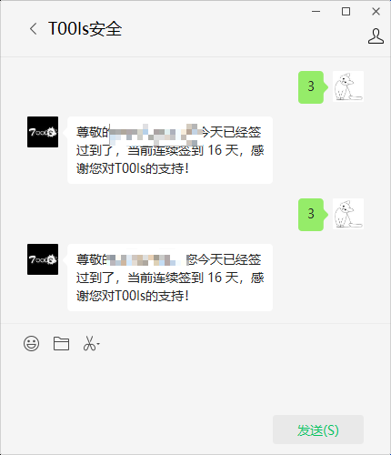

## 实现 

本程序可以实现t00ls的微信PC端定时签到功能（TuBi不易，好不容易注册个号，长时间不登还是僵尸号！）

使用golang 遍历窗口句柄，筛选微信相关的句柄
匹配相应的微信聊天框
发送指定的消息
结束

## 条件

需要单独拖出t00ls的聊天框，缩放到最小 聊天框要前台！
~微信聊天框默认的最小大小为width: 430, height: 500 （程序里需要做匹配判断）~  
微信聊天框最小大小为width: 400, height: 374   

也可以指定微信聊天框放到角落里，然后再代码里做判断 （以后再弄吧）

## 生成

go build  -ldflags="-s -w -H windowsgui" .\main.go

## 效果 

## 定时执行

windows 任务计划
